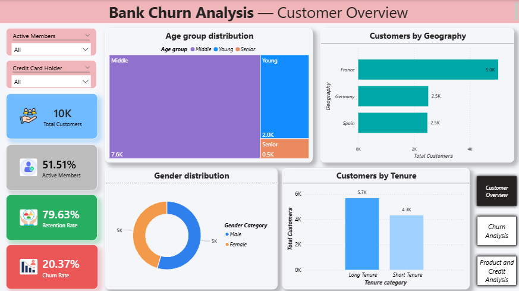
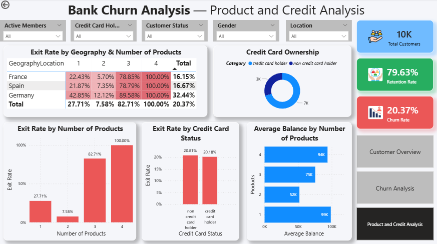

# Bank Churn Analysis — Power BI

## Project Overview

This project analyzes customer churn for a banking dataset using Microsoft Power BI.

The dashboard provides insights into customer demographics, churn patterns, product usage, credit card ownership, geography, tenure, and customer balances.

## Objectives

- Analyze customer churn and retention
- Identify customer segments with different exit rates
- Analyze churn across geography and gender
- Understand the relationship between product usage and churn
- Analyze credit card ownership
- Create an interactive Power BI dashboard
- Apply DAX measures and calculated columns

## Tools & Technologies

- Power BI
- DAX
- Power Query
- Microsoft Excel / CSV
- Data Visualization

## Dashboard Pages

### 1. Customer Overview

The Customer Overview page contains:

- Total Customers
- Active Member %
- Retention Rate
- Churn Rate
- Age Group Distribution
- Customers by Geography
- Gender Distribution
- Customers by Tenure

---

### 2. Churn Analysis

The Churn Analysis page contains:

- Exit Rate by Geography & Gender
- Exit Rate by Age Group
- Retained vs Exited Customers
- Average Balance by Age
- Interactive filters for customer attributes

---

### 3. Product & Credit Analysis

The Product & Credit Analysis page contains:

- Exit Rate by Geography & Number of Products
- Credit Card Ownership
- Exit Rate by Number of Products
- Exit Rate by Credit Card Status
- Average Balance by Number of Products

## Key Findings

- Overall customer churn rate is approximately 20.37%.
- Retention rate is approximately 79.63%.
- Senior customers show a higher observed exit rate than younger customers in this dataset.
- Exit rates vary across geographical locations.
- Exit rates differ considerably across product-count groups.
- Customers with four products show a 100% observed exit rate in this dataset.

## DAX

The project uses DAX measures for:

- Customer count
- Exited customers
- Retention rate
- Exit rate
- Average balance
- Average salary
- Total Active Customers

See [DAX Measures](DAX_Measures.md).

## Project Files

| File | Description |
|---|---|
| `Bank_Churn_Analysis_Dashboard.pbix` | Power BI dashboard |
| `Datasets` | Datasets |
| `DAX_Measures.md` | DAX calculations |
| `Output-Screenshots/` | Dashboard screenshots |
